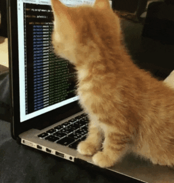

### Hi, I'm THIEN LE  

- 🔭 Passion in something ... (secret😊)
- 💪 2021 Goals: Start learning programming
- ⭐: Reading, listening, playing game... and blade wind😅

### :zap: My Skill

  

### Languages and Tools:

 

---

### 📫 Contact me via:
- EMAIL: ducthienle95@gmail.com
- FACEBOOK: [LÊ ĐỨC THIỆN](https://www.facebook.com/Crowz.102)
- STEAM: [Crowz102](https://steamcommunity.com/profiles/76561199012288125)

[website]: https://www.youtube.com/channel/UC9L5_YMFz8JfBeQtUic8-3A
